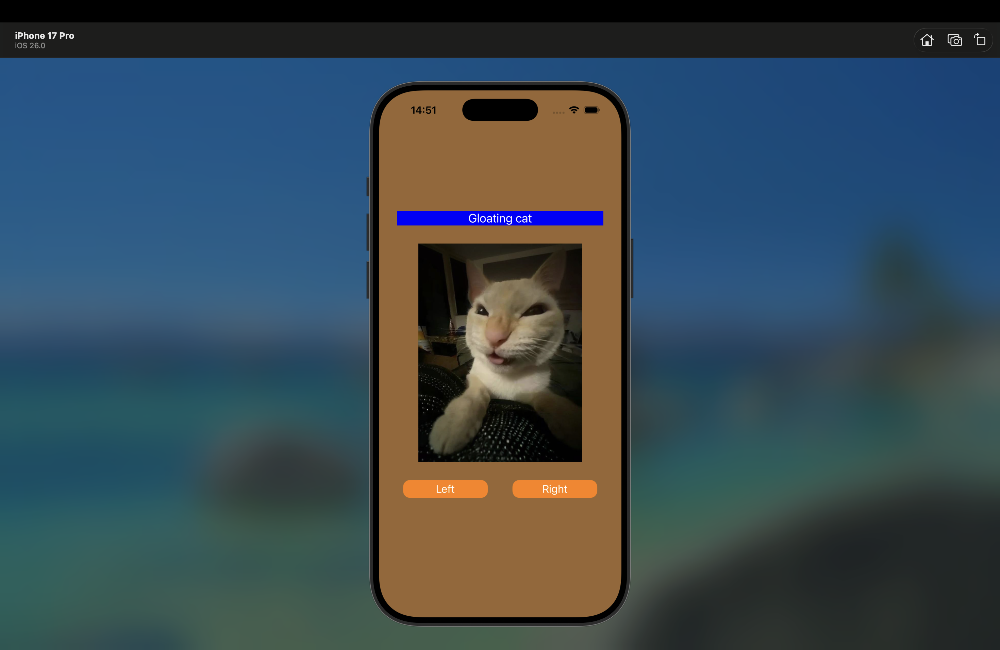
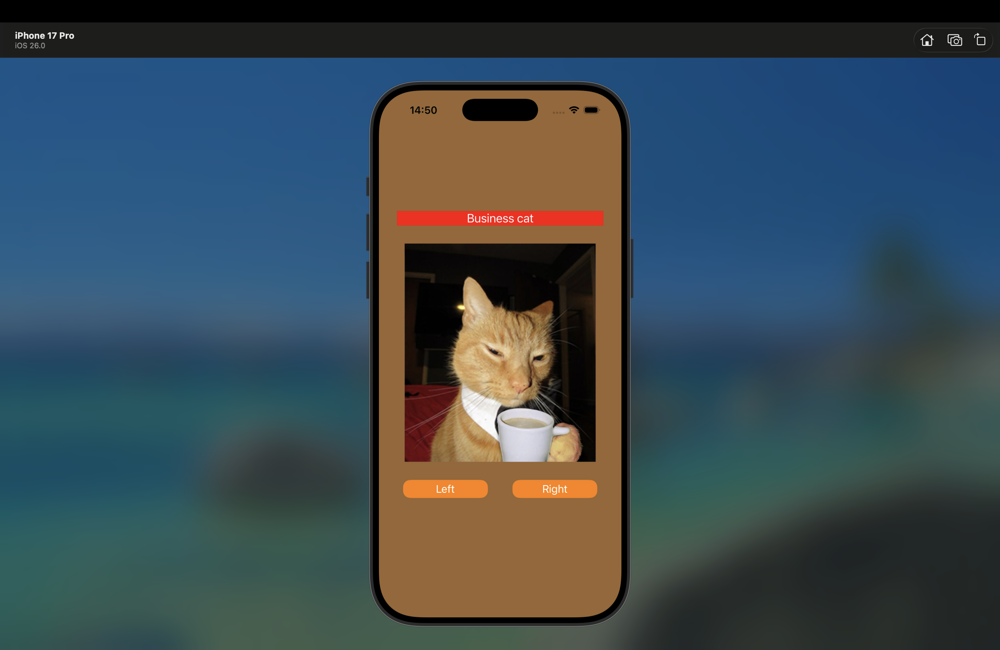
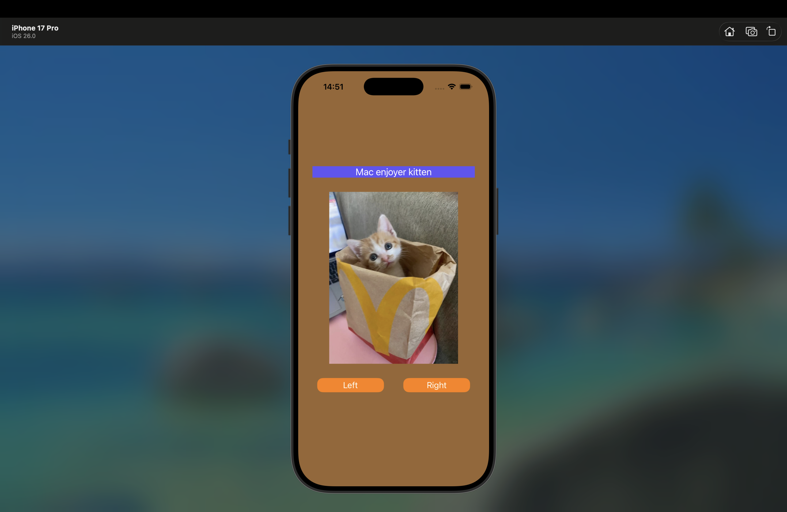

# Cat Viewer

Простое iOS-приложение для просмотра случайных котиков с переключением по кнопкам.

## Фичи
- Переключение изображений кнопками ← / →
- Анимация смены изображений
- Полностью программный интерфейс (без Storyboard)

## Технологии
- UIKit
- Auto Layout (Constraints)
- Swift

## Скриншоты
  
  
  

